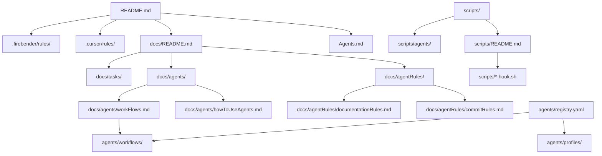

# Worker

Worker is a repo-agnostic agentic workflow skeleton for consistent delivery across roles.
It provides named agents, dependency-aware workflows, and documentation rules so teams can
plan, implement, review, and ship changes with a repeatable process.

**What It Solves**
- Consistent sequencing across planning, implementation, review, QA, docs, commit, and push.
- Clear role separation with guardrails to prevent role mixing.
- Repeatable workflows encoded in `agents/workflows/`.
- Centralized rules and checklists under `docs/agentRules/`.

**Start Here**
- `Agents.md` for a quick reference geared toward AI agents.
- `docs/README.md` for the documentation index.
- `docs/agentRules/README.md` for enforceable rules and checklists.
- `docs/agents/howToUseAgents.md` as the primary guide for workflows in chat or terminal.
- `docs/agents/usingAgentsInChat.md` for chat-first workflow guidance.
- `docs/agents/usingAgentsInTerminal.md` for terminal-first workflow guidance.
- `docs/agents/overview.md` for where agent configs live.
- `agents/workflows/` as the source of truth for workflow definitions.

**Workflow Guide**
- Delivery flow for code changes and feature delivery.
- Product flow for research, PRD updates, and sprint planning.
- Feature breakdown flow for requirements, epics, stories, and tasks.
- Agile delivery flow for end-to-end work from requirements to delivery.
- Tech debt flow for refactors, stabilization, and cleanup.
- Research spike flow for time-boxed exploration and recommendations.

**How It’s Used**
- For chat-based use, follow `docs/agents/howToUseAgents.md` and
  `docs/agents/usingAgentsInChat.md`.
- For terminal-based use, follow `docs/agents/howToUseAgents.md` and use the runner scripts under
  `scripts/agents/` to scaffold steps.
- For DAG scheduling details and status gating, see `docs/agents/dagScheduler.md`.

**AI Usage Paths**
- **Chat/GUI tools:** Use `docs/agents/usingAgentsInChat.md` as the primary guide. It covers role
  sequencing, flow triggers, and how to pass outputs between steps. Cursor users should also review
  `.cursor/rules/` for the loaded workflow and role rules.
- **Terminal users:** Use `docs/agents/usingAgentsInTerminal.md` as the primary guide. It explains
  how to run workflow scripts in `scripts/agents/` and complete the generated step files in order.

**Rules You Must Follow**
- `docs/agentRules/workflowRules.md` for planning, review, and summaries.
- `docs/agentRules/commitRules.md` for commit format and pre-commit checks.
- `docs/agentRules/documentationRules.md` and `docs/agentRules/noCodeInDocsRule.md` for docs constraints.
- `docs/agentRules/prioritizationRules.md` for Next Up vs Backlog decisions.
- `docs/agentRules/testingRules.md` for testing requirements.
- `docs/agentRules/codingStandards.md` for style, naming, and KDoc requirements.
- `docs/agentRules/architectureRules.md` for architecture boundaries.
- `docs/agentRules/thoughtfulCollaboration.md` for critical thinking and collaboration.

**Documentation Structure**
- `docs/architecture/` for system overview, constraints, and decisions.
- `docs/product/` for PRD, feature list, and roadmap.
- `docs/quality/` for test strategy and QA checklist.
- `docs/release/` for release notes and versioning policy.
- `docs/onboarding/` for setup and conventions.
- `docs/tasks/` for work boards and work plans.

**Relationship Diagram**

**Repository Layout**
- `agents/` for registry, profiles, prompts, workflows, and memory.
- `.cursor/` for Cursor rules.
- `.firebender/` for Firebender agent definitions and rules.
- `scripts/agents/` for runner scripts and wrappers.
- `docs/` for documentation, including agent rules and how-to guides.
- `tests/agents/` for agent tests and evals.

**Enhancements**
- Define a branching strategy (including whether to use branch-per-story).
- Document default build, test, and QA commands for new repos.
- Add CI templates or guidance for automated checks.
- Provide an example project configuration and minimal setup checklist.

**Contributing**
- Follow the rules in `docs/agentRules/` before any commit.
- Keep documentation concise and update `docs/README.md` when adding new docs.
- Do not include code snippets in markdown, except Mermaid diagrams.
