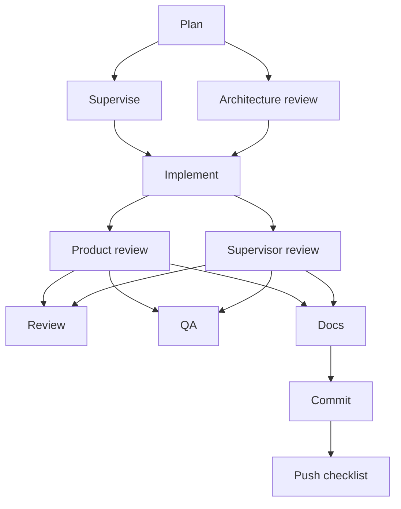
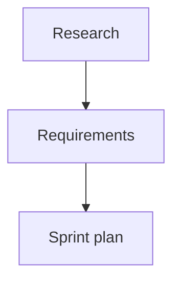
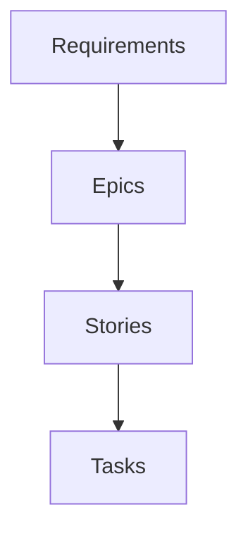
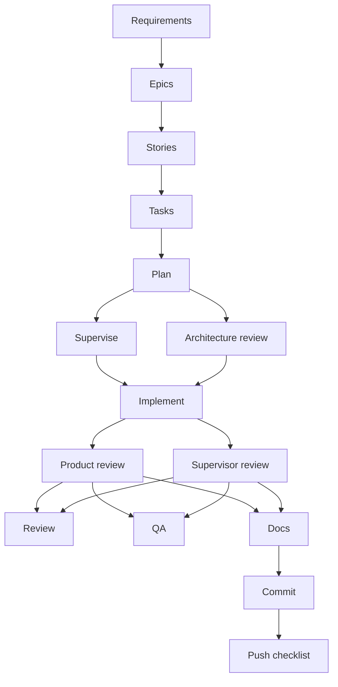
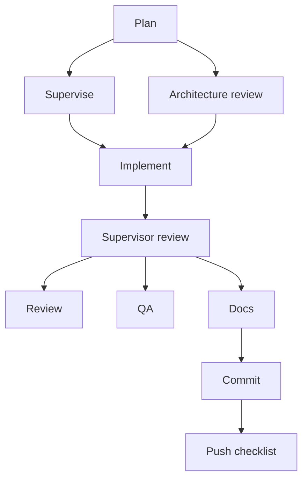
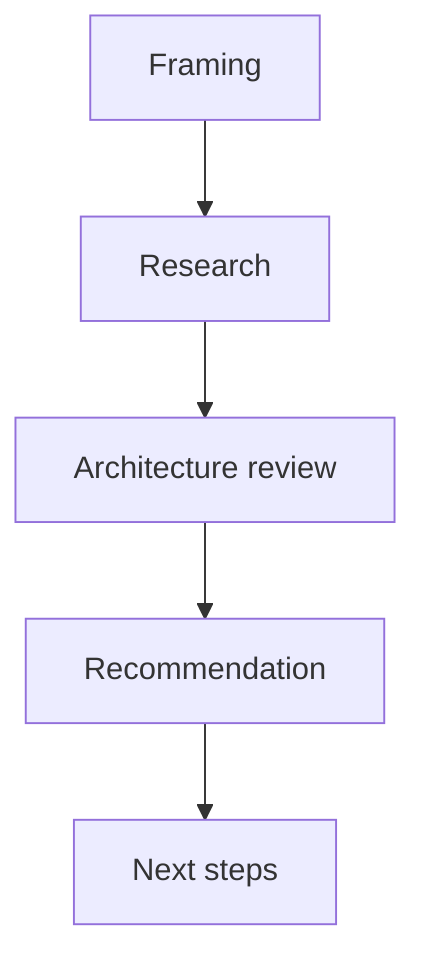

# Workflow Guide

This guide summarizes the available workflows and when to use them. Workflow definitions live in
`agents/workflows/` and are the source of truth.

## Delivery Flow

Use for code changes and feature delivery.

Sequence:

## Product Flow

Use for research, product requirements, and sprint planning.

Sequence:

## Feature Breakdown Flow

Use to turn a feature idea into requirements, epics, stories, and tasks.

Sequence:

## Agile Delivery Flow

Use for end-to-end delivery from requirements to implementation and review.

Sequence:

## Tech Debt Flow

Use for refactors, stabilization, and cleanup work.

Sequence:

## Research Spike Flow

Use for time-boxed exploration with recommendations.

Sequence:

## Related References

- `docs/agents/howToUseAgents.md` for usage guidance in chat or terminal.
- `docs/agents/dagScheduler.md` for DAG scheduling rules.
- `agents/workflows/` for the workflow definitions.
